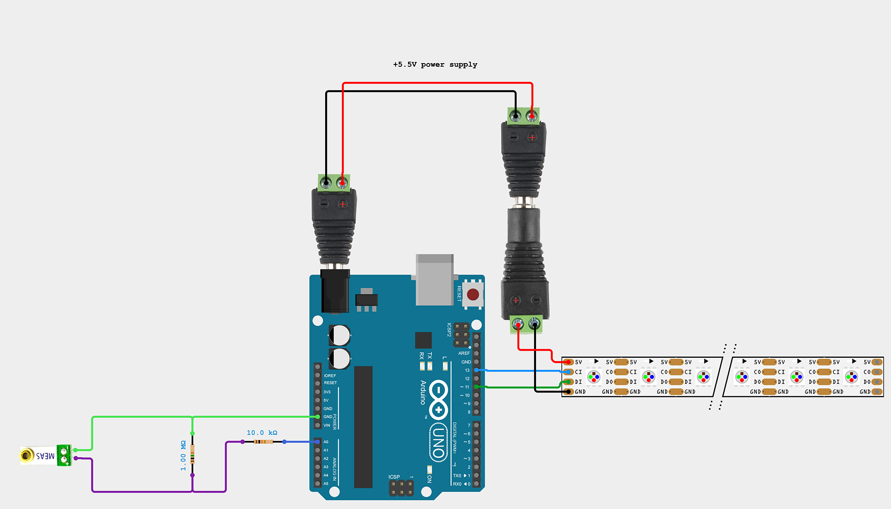

# Arduino Test

The long-term plan is to use an M5 Atom ESP32 to control the lighting, but initial testing was done on an Arduino.

## Parts List

* [Arduino Uno R3](https://store-usa.arduino.cc/products/arduino-uno-rev3)
* [Piezo Vibration Sensor - Small Horizontal](https://www.sparkfun.com/products/9198)
* [APA102 4-wire LEDs](https://www.sparkfun.com/products/14016)
* 1MΩ and 10kΩ resistors
* DC Barrel Jack Adapters - [Male](https://www.sparkfun.com/products/10287) & [Female](https://www.sparkfun.com/products/10288)
* 5+V power supply
    * When powered through the barrel jack the Arduino Udo requires a power supply that gives 7.5V ideally, up to 9V or 12V. The APA102 light strip should not be fed much more than 5V. They way I've chosen to share the power between Arduino and lights with a single power supply works acceptably if the power supply is set to 5.5V.
    * Switching from Arduino Uno to M5 Atom will lower the power requirements back down to a shared 5V.

## Connections

1. Connect pin 13 of the Arduino to the clock input for the light strip
2. Connect pin 11 of the Arduino to the data input for the light strip
3. Connect the 1MΩ resistor in parallel with the piezo sensor
4. Connect a ground from the Arduino to the negative terminal for the piezo sensor
5. Connect the positive terminal for the piezo sensor in series with the 10kΩ resistor to the A0 analog pin of the Arduino
6. Connect the positive and negative of the power supply to both a barrel connector for the Arduino and the power feed to the lights
   * _Note: if you choose to power the lights and Arduino separately, note that they must share a common ground for the lights to receive proper signals. Wiring a ground pin from the Arduino to the light's ground should suffice._